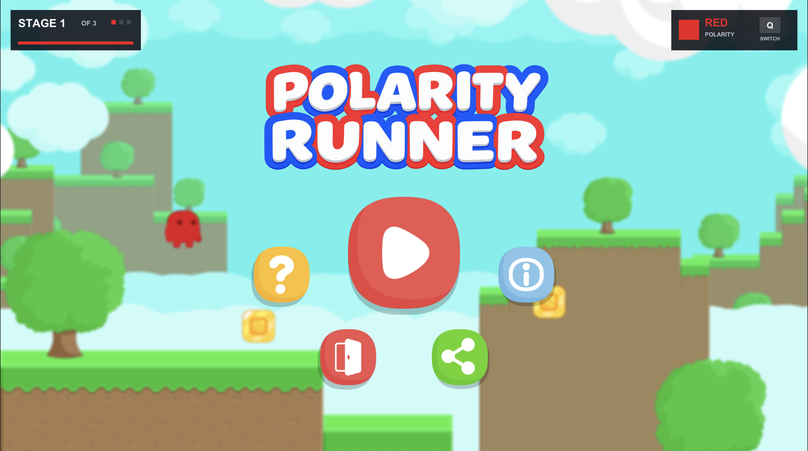
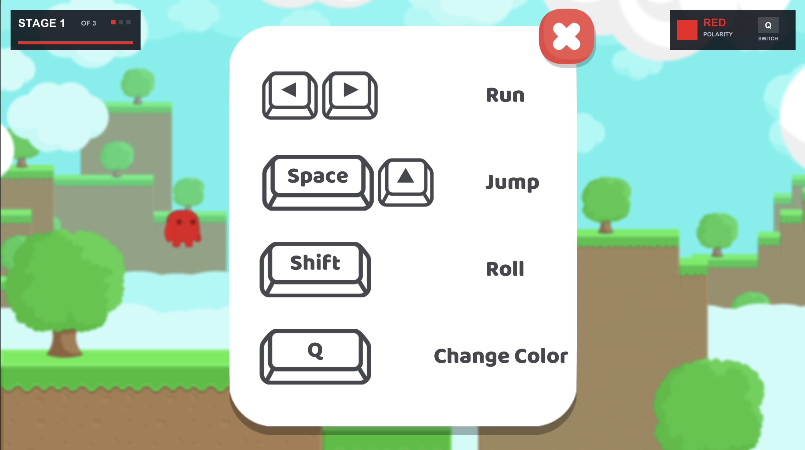
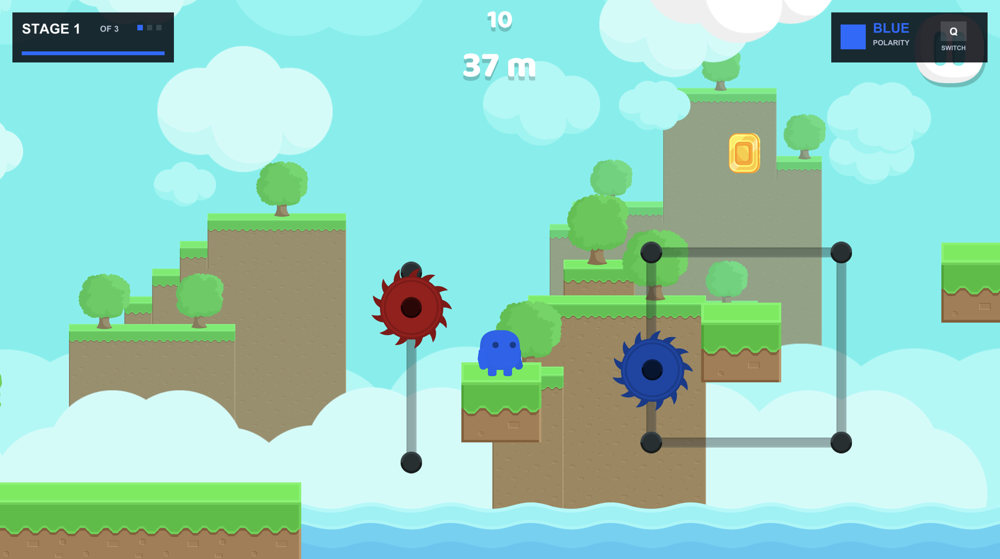
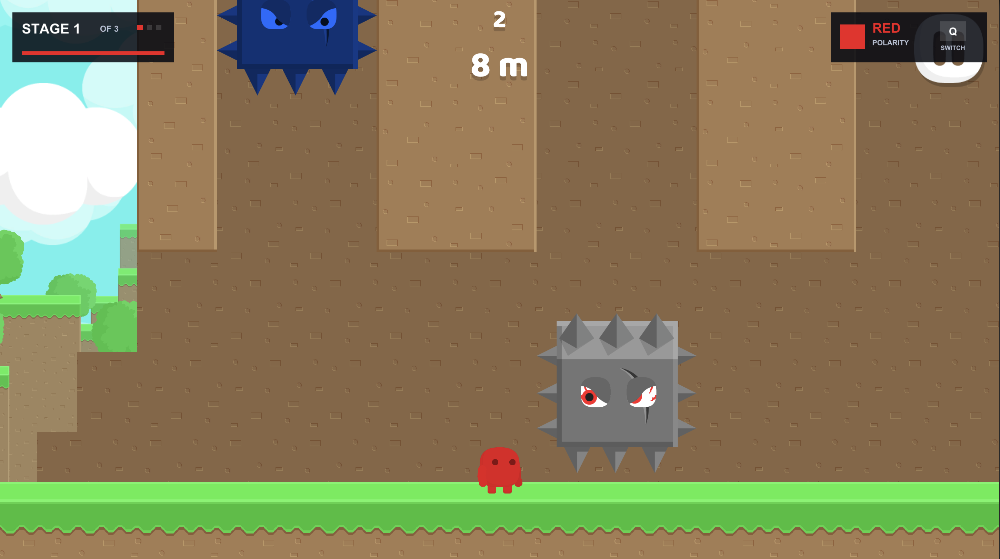
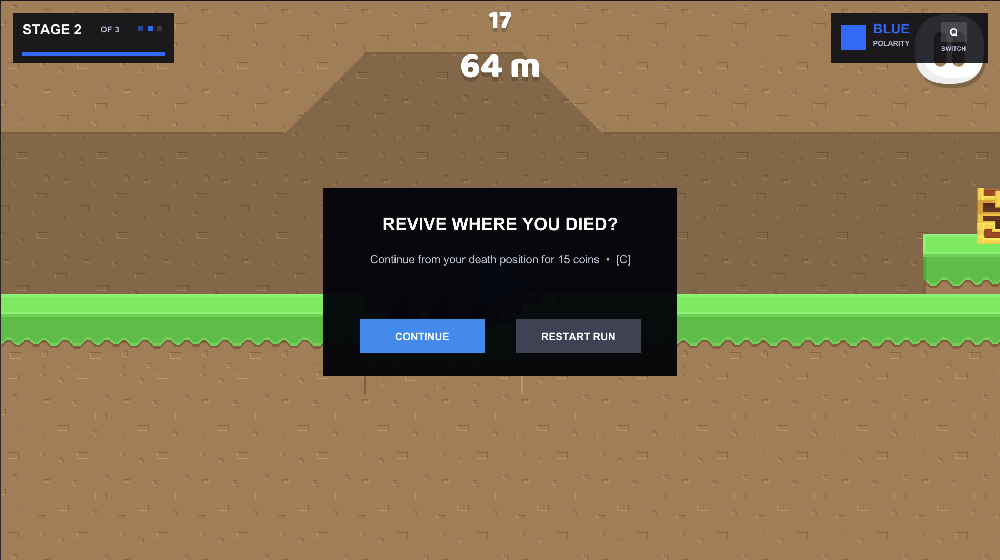
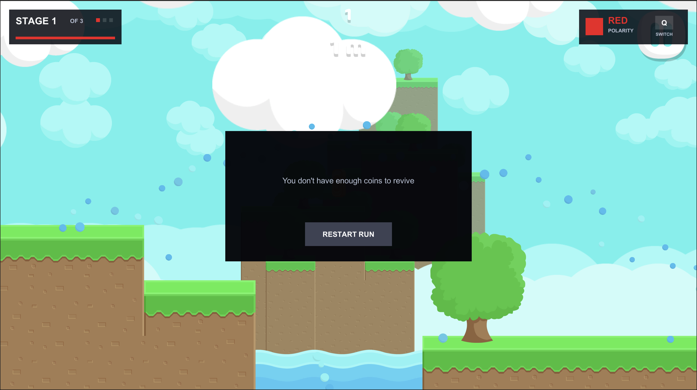
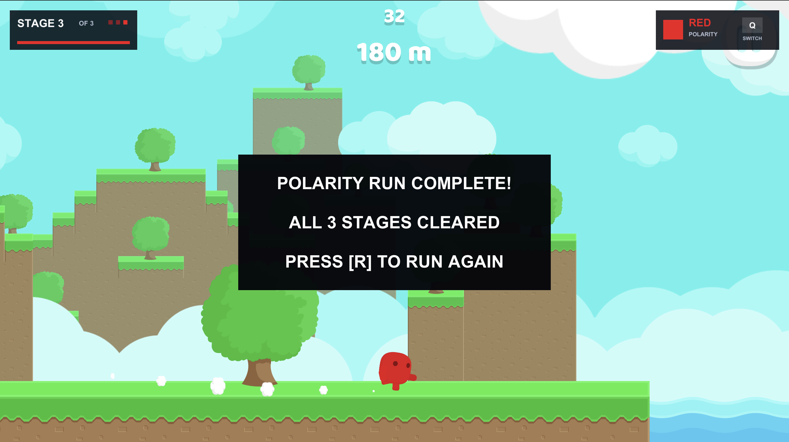

# Polarity Runner

## Description

Polarity Runner is a fast-paced 2D platform runner developed with Unity. The player travels through a procedurally assembled course, collects coins, avoids environmental dangers, and switches between red and blue polarity to survive colored hazards.

Hazards follow three color rules:

- **Red hazards** damage the player while the player is red.
- **Blue hazards** damage the player while the player is blue.
- **Default-colored hazards** damage the player regardless of polarity.

The game contains three increasingly difficult stages. Hazard colors change more frequently in later stages, and the run is completed after travelling 180 metres. Collected coins are saved between sessions and can be spent to revive near the player's death position. Choosing to restart instead of reviving resets the coin balance to zero.

### Main features

- Red and blue polarity switching
- Red, blue, and always-active default hazards
- Procedurally generated terrain and backgrounds
- Three difficulty stages
- Coins, chests, saved currency, and paid revival
- Character animation and ragdoll death effects
- Music, ambient audio, and gameplay sound effects
- Pause, completion, and revival interfaces

## Screenshots

| Screenshot | What it should show | Filename |
| --- | --- | --- |
| Start screen | Logo and the Play, Help, Info, and Exit controls | `start-screen.png` |
| Help screen | All controls, including **Q — Change Color**, with even spacing | `help-screen.png` |
| Polarity gameplay | The player, polarity HUD, and red or blue hazards | `polarity-gameplay.png` |
| Default hazard | An original-colored hazard that is dangerous to both polarities | `default-hazard.png` |
| Revival available | The revive cost and both Continue and Restart Run buttons | `revival-available.png` |
| Revival unavailable | The insufficient-coins message and centered Restart Run button | `revival-unavailable.png` |
| Run complete | The completion panel after clearing all three stages | `run-complete.png` |

Once the files are added, display them here using the ready-to-copy Markdown in the screenshot checklist.

## Members

| Name | ID |
| --- | --- |
| Hein Oke Soe | 6611717 |
| Khine Khant | 6611718 |

## Gameplay

### Stage progression

| Stage | Distance | Difficulty |
| --- | ---: | --- |
| Stage 1 | 0–60 m | Longer color sections |
| Stage 2 | 60–120 m | Faster color changes |
| Stage 3 | 120–180 m | Fastest color changes |

### Revival costs

| Revival during a run | Cost |
| --- | ---: |
| First | 15 coins |
| Second | 30 coins |
| Third and later | 60 coins |

The **Continue** option is shown only when the player has enough coins. Otherwise, the revival screen displays an insufficient-coins message and only the **Restart Run** button. Restarting from this screen resets the saved coin balance to zero.

### Controls

| Control | Action |
| --- | --- |
| Left/Right Arrow or A/D | Move |
| Space | Jump |
| Q | Switch polarity |
| Escape | Pause or resume |
| C | Accept revival |
| R | Restart the run; from the revival screen, this resets coins to zero |

## Requirements

- Unity `6000.5.3f1`
- A desktop operating system supported by Unity

Using the specified Unity version is recommended to avoid automatic package, asset, or scene serialization changes.

## Running the project

1. Install Unity `6000.5.3f1` through Unity Hub.
2. Add this directory as an existing Unity project.
3. Open `Assets/Scenes/Play.unity`.
4. Press the Play button in the Unity Editor.

## Licence

MIT
